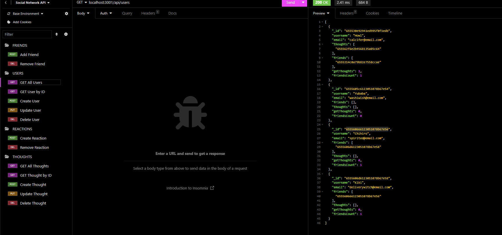

# socialNetworkAPI

## Description

- I wanted to create a back end api for a social network application where people can create users, share posts(thoughts), react to posts, and add friends.
- This project was built to show my ability to use mongo/mongoose in a back end application.
- Having all of the back end routes set up and working successfully will make connecting to a front end application much more streamline. 
- I learned the similarities and differences between the strictness of SQL and the contrasting use of mongo/mongoose.

## Table of Contents 

- [Installation](#installation)
- [Usage](#usage)
- [Credits](#credits)
- [License](#license)

## Installation

The package.json has all of the node packages necessary. Npm install, open in insomnia at localhost:3001 and follow the respective routes. 

## Usage

    
   

## Credits

readMe template: [Professional README Guide](https://coding-boot-camp.github.io/full-stack/github/professional-readme-guide)

## License

MIT License

Copyright (c) [2023] [Mitchell Wandall]

Permission is hereby granted, free of charge, to any person obtaining a copy
of this software and associated documentation files (the "Software"), to deal
in the Software without restriction, including without limitation the rights
to use, copy, modify, merge, publish, distribute, sublicense, and/or sell
copies of the Software, and to permit persons to whom the Software is
furnished to do so, subject to the following conditions:

The above copyright notice and this permission notice shall be included in all
copies or substantial portions of the Software.

THE SOFTWARE IS PROVIDED "AS IS", WITHOUT WARRANTY OF ANY KIND, EXPRESS OR
IMPLIED, INCLUDING BUT NOT LIMITED TO THE WARRANTIES OF MERCHANTABILITY,
FITNESS FOR A PARTICULAR PURPOSE AND NONINFRINGEMENT. IN NO EVENT SHALL THE
AUTHORS OR COPYRIGHT HOLDERS BE LIABLE FOR ANY CLAIM, DAMAGES OR OTHER
LIABILITY, WHETHER IN AN ACTION OF CONTRACT, TORT OR OTHERWISE, ARISING FROM,
OUT OF OR IN CONNECTION WITH THE SOFTWARE OR THE USE OR OTHER DEALINGS IN THE
SOFTWARE.

## Features

This backend application has the ability to do full CRUD on users and 'thoughts'(posts) as well as post and delete routes for reactions and friends.

## How to Contribute

Feel free to use this code. If you have any suggestions or would like to see more of my work, please check out my [Github](https://github.com/MWandall).

